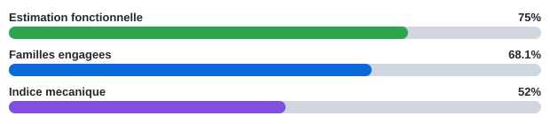

# Monopoly — portage moderne

Ce dépôt conserve le code source historique de *Monopoly* et accueille le
portage moderne "work in progress".

Le portage, encore en cours, utilise C et C++23 avec des technologies portables
actuelles. Il se trouve dans [`modern/`](modern/), tandis que le code d'origine
reste disponible dans [`Source/`](Source/).

## 📊 Progression

Le suivi est automatis? ? partir de [`modern/PORTING_STATUS.md`](modern/PORTING_STATUS.md).
Le SVG ci-dessus est r?g?n?r? par GitHub Actions a chaque changement suivi sous `modern/`
(hors SVG g?n?r?), lors d'une modification du workflow/script, chaque nuit ou manuellement.

Les trois barres ont volontairement des sens diff?rents :

- **Estimation fonctionnelle** : estimation prudente maintenue dans `PORTING_STATUS.md`; GitHub Actions la lit et l'affiche automatiquement.
- **Familles engag?es** : calcul automatique des familles `Jeu Monopoly` + `Services ArtLib` qui ne sont plus `NOT_STARTED`.
- **Indice m?canique** : calcul automatique sur toute la matrice active : complet/remplac? = 100 %, partiel = 50 %, non d?marr? = 0 %; bloqu?/tooling/legacy-unused sont exclus.

Ainsi, l'indice m?canique peut rester stable pendant qu'une grosse famille d?j? `PORTED_PARTIAL` progresse fortement; les trois barres ?vitent de confondre cette mesure avec la progression fonctionnelle globale.

## Sources et crédits

Le code d'origine est désormais accessible publiquement. Sa provenance reste
citée ici :

- [Dépôt public du code source d'origine](https://github.com/RetailGameSourceCode/Monopoly)
- [Publication citée dans le README d'origine](https://twitter.com/MrTalida/status/1025016038394613760)

Le [README d'origine](README_ORIGINAL.MD) est conservé tel quel dans ce dépôt.
